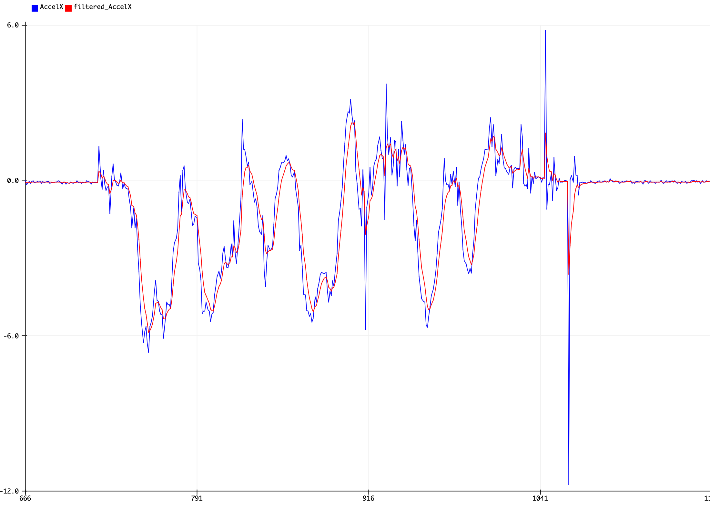

# Bayesian-filtering
Bayesian filtering, or as it turns out, is a simplified Kalman filter (univariate, no control actions, no transition matrices).
I used this to filter the data from IMU (MPU6050), accelerameter + gyroscope.
I refered to this article: https://www.magesblog.com/post/2014-12-02-measuring-temperature-with-my-arduino/

#### (Hardware platform: custom designed nRF52840 board with Adafruit Feather nRF52840 Express bootloader, VSCode + PlatformIO)

